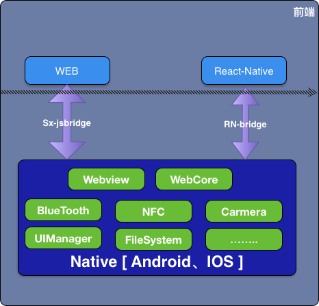

# 闲谈Web前端

原创文章 作者 [Jerry](https://github.com/xusai2014)

---
>产品C端属性决定了，前端技术栈的横向跨度较大，前端应用高可用性要求高。目前开发平台有IOS、Android、React-native、Web，
>开发语言以Java、javascript、Object-C为主。

如何理解前端，如下图所示：

这是一个典型的中台-小前端的模式，Native提供中台输出，Web、ReactNative提供业务支持

Web端开发人员，需要关心三个交互，两个兼容性：
+ 用户交互
    + 用户交互是基于人机交互原则、产品架构，而给出的设计原型。
    + 用户交互方案会因结果倒逼而进行调整，例如：
    > 接入第三方web页面A，期望A作为子流程展现在我们的站点B中，并且B交互过程中
可以与A的流程进行沟通。受限于安全往往作为非法者不允许在B中直接操作A中元素，此时建议将A以弹窗形式展示，处理完A流程直接关闭
在B中继续下一步流程。这样即兼顾了美感、流程设计更合理。所以Web开发在弱场景下实现业务需求，需要反馈出问题，给出建议。
+ 后台交互

    + Web开发人员，后台交互过程减少交互次数、明确需要数据，减少冗余数据返回、优化错误处理
    
+ APP交互

    + Web开发需要定义出具体入参、出参，尽量复用已有接口。
   
+ 系统兼容性

    + C端产品，面向最广大用户，系统兼容性需要考虑不同厂商浏览器兼容性、浏览器版本兼容性、APP平台兼容性。浏览器兼容性可通过转译、垫片独立解决，平台兼容性依赖APP开发者提供解决方案，web端配合。

+ API版本兼容性

    + API版本兼容性，后台API、APP API。后台API暂时不区分版本处理，只需要配合接口优化。APP需要考虑版本碎片化，新增APP接口方案对于旧版本APP如何处理。

######### 交互设计是设计人员根据业务需求，结合各端需要和限制而商讨出的约束，确定的输入给出确定的输出。
######### 👆接口即文档，好的接口约束，可以降低各端复杂度和协作难度。

## 技术栈
+ HTML5(简单介绍比较有用的技术点)
    + PostMessage:解决跨域、窗口通信问题
    + LocalStorage/SessingStorage:Web端数据存储
    + Canvas:绘制图形、HTML转PDF
    + Video/audio: 播放流媒体
    + Input: placehoder、输入类型number/date/text/passwrod、长度min/max、disabeld
    + requestAnimationFrame
    + WebGL
    + IndexDB
    + .....
+ Sass/less/Css

    + 移动端适配方案：rem、vm
        + rem:通过动态计算屏幕尺寸和设计尺寸的比例，来设定HTML根节点的字体大小，全局样式渲染是根据根节点字体适配
        + vm:基于视区的百分比
    
    + 样式模块设计
        + 通用性样式抽取，模块化引入
        + 样式预处理postCss
+ Ajax/fetch
    + [Axios](https://github.com/axios/axios)请求库基于xmlHttpRequest封装,常用于网络资源请求的场景。
        + 抽象出Axios实例，通过配置化方式根据不同的场景，初始化不同的网络请求对象
            例如：web实现API server A和 API server B后台交互，后台定义了不同的交互规则
                
                 const axios = require('axios');
                 export const axiosA = axios.create('https://server.a.com',{
                      baseURL:"https://exampleA.api.com"
                 })
                 export const axioB = axios.create('https://server.a.com',{
                                       baseURL:"https://exampleB.api.com"
                                  })
    + [fetch](https://developer.mozilla.org/zh-CN/docs/Web/API/Fetch_API/Using_Fetch)接口抽象出了Headers、Request、Response对象。
+ DOM/BOM API
    + DOM增删改查接口
    + DOM事件流，事件捕获、事件目标、事件冒泡
    + BOM浏览器交互接口，路径导航、浏览器信息查询、base64转换、屏幕信息
+ ES6等语法糖
    + Object、const/let、解构、Promise、class、async/await
+ React
    + 生命周期
        + 创建周期 componentWillMount render componentDidMount
        + 更新周期 
        + 销毁  compoentWillUnmount
    + 父子通信／兄弟通信
        + 父子通信组件间传值，数据单向流动，
        + 兄弟通信，通过共同的父组件管理状态同步信息
        
    + 状态管理，全局状态管理、组件状态管理
        + 全局状态:提示框、路由、权限管理
        + 组件状态管理：页面数据、交互效果
    + 高阶组件设计
    + 通用性UI组件设计
    + 组件复用性
    
+ React-router
    + react-router设计理念
    + 组件化设计
    + 基于路由的代码分割
+ Redux
    + Redux设计理念
    + 共享数据的管理
    + 数据一致性设计
    
+ Antd/Antd-mobile
    + 定制化使用
    + 按需加载
+ echart
    + 前端数据模型设计，组件设计
    
+ Babel
    + Babel 6/Babel 7
    + Presets/Plugins/Transform/Polyfill
    
+ Eslint
    + 代码风格校验
        airbnb
    + 使用方式
        打包器配置使用
        IDE编辑器配置使用
+ webpack
    + 基础配置
    + 插件使用
    + 定制本地化开发环境
    + 打包分析
+ npm/yarn
    + npm包开发规范
    + yarn使用场景
    + nrm
    + nvm
    + 镜像切换
+ git
    + git开发流程
    + git使用技巧
    + 合并代码，解决冲突
    + git辅助理解
+ Browser Environment
    + 浏览器安全措施
        同源策略
        内容安全保护策略
    + 浏览器工作原理
    + 浏览器辅助工具
+ CommonJS规范
    + 演变历史
+ HTTP协议
应用层协议，基于TCP/IP通信协议传输数据。HTTP消息格式：请求行、请求头部、空行和请求数据四个部分组成。
    + cache
        用于提高Web性能，首先要理解缓存的存储策略、失效策略、缓存对比策略。
    + cookie
    + CORS
    + Session
    + HTTP各个版本
    + CSP
    + HTTP状态码
    + HTTP Method
    + HTTP Headers
+ Nginx
    + 反向代理与正向代理
    + 前端使用详解
        单页应用配置路径匹配规则
        用户请求头信息透传
        gizp配置
        代理转发
+ Jekins
    + Jekins集成步骤
        
    + 多环境详解
+ UI框架
    + Bootstrap
    + jQuery
+ Web框架
    + React
    + Vue
    + Angular
+ 第三方库
    + lodash
    + moment
    + Crypto-js
    + xlsx
    + codemirror
    + medium-editor
    + shelljs
    + yeoman
+ Webview
    + webview基础概念
+ Typescript/Flow
    + 使用场景
        大前端团队协作、无界面渲染、中台-小前端模式协作
+ SEO友好
    搜索爬虫、社交平台分享，服务端渲染、富媒体对象
+ License
    MIT\BSD,了解开源license有助于我们在选取开源框架过程避开版权风险
